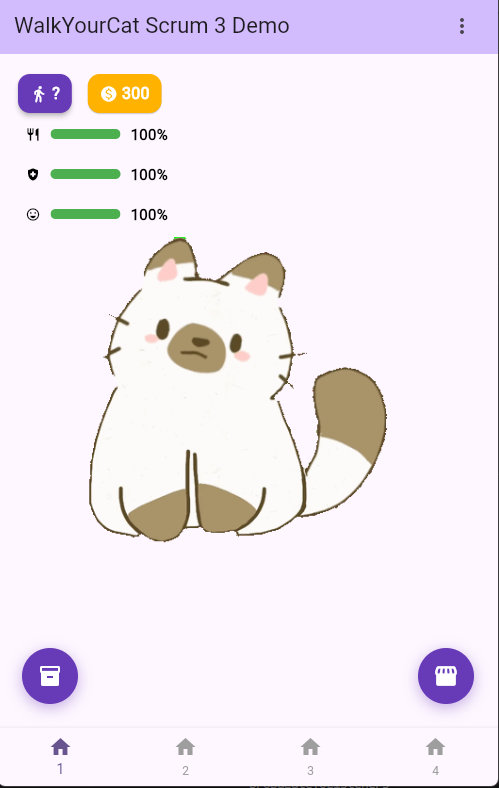
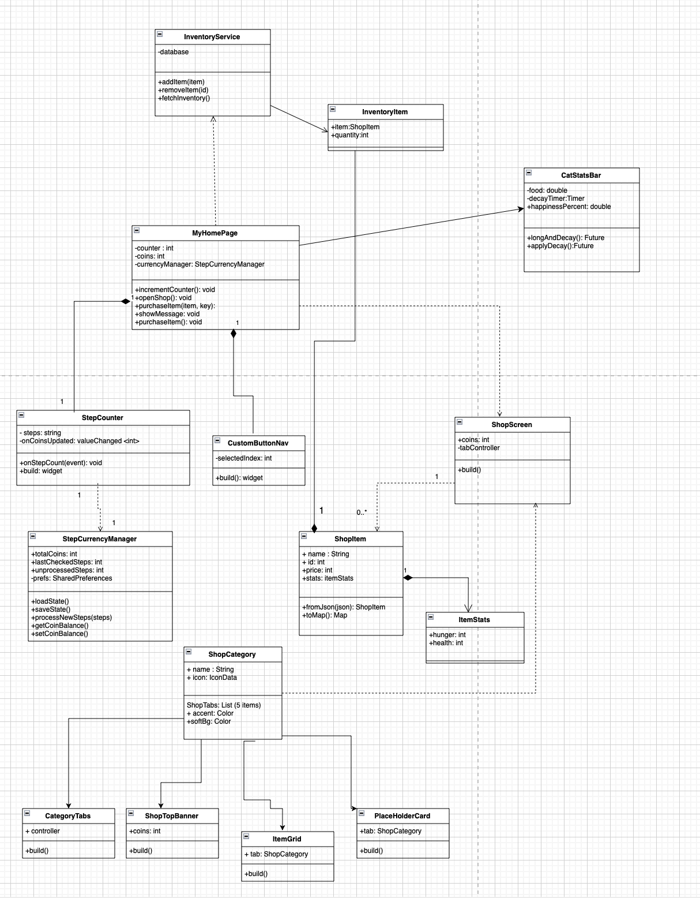

# WalkYourCat
## CIS 3296 Final Project
WalkYourCat is for people who want motivation to increase their daily physical activity and exercise. It is a fitness app grounded in game theory that allows users to convert their physical activity into a positive response loop by taking care of their virtual pet.



## UML Class Diagram



## Getting Started

To run and build WalkYourCat, install the flutter SDK. Flutter has [helpful instructions](https://docs.flutter.dev/install) for installation.

For help getting started with Flutter development in general, view the
[online documentation](https://docs.flutter.dev/), which offers tutorials,
samples, guidance on mobile development, and a full API reference.

## How to Run
- If it's your first time running do the following 

```
flutter doctor -v
```

### fix errors first before continuing:
```
flutter clean
flutter get pub
```
- If the above steps have been done before just skip to the next command
- Download the latest binary from the Release section on the right on GitHub.  
- On the command line do:
```
flutter run
```
- This command first checks for devices available to run the app on.

for example
```
[1]: macOS (macos)
[2]: Windows (windows)
[3]: Chrome (chrome)
```

or a connected device such as an Android or iOS phone.

- Select your chosen device/emulator to run the app.
- You will see the app open up on the browser or the phone.

## How to Contribute
Follow this project board to know the latest status of the project: [https://github.com/orgs/cis3296s26/projects/35]([https://github.com/orgs/cis3296s26/projects/35])  

## How to build locally during Development
- Clone and use this github repository: https://github.com/cis3296s26/WalkYourCat
- Specify what branch to use for a more stable release.  
- Use Andriod Studio for Android, XCode for IOS or any other IDE such as VSCode for the browser version.
- To be able to run the code dart: ">=3.9.0-0 <4.0.0" and flutter: ">=3.35.0" is required to be installed prior.
- Go to "How to run" to see how to run the app.

## How to Install & Build
### Android
From the Command line directly to your device:
- Connect your Android-powered device to your computer with a USB cable.
- Enable Developer Options in your Android device settings. To do this, go to `Settings > About phone > Build number`. Tap Build number 7 times and enter your device PIN for security purposes.
- When Developer Options are activated, toggle to turn on **USB Debugging**.
- On your computer terminal, enter ```cd WalkYourCat``` if not already in the project directory.
- Run  ```flutter install```.
- You will be prompted to select the device you wish to install to, something like the following:
```
[1]: macOS (macos)
[2]: Windows (windows)
[3]: Chrome (chrome)
[4]: android-xyz (android)
```
select android as it is your targeted device.

Alternatively, an apk can be built for each target Android API level:
```
    cd WalkYourCat
    flutter build apk --split-per-abi
```
### iOS (on macOS only)
Since iOS has higher security restrictions, **XCode** will be required to install on iOS.

Open WalkYourCat in XCode and run ```flutter install```. Follow the prompt to install to your device or emulator as instructed above in the **Android** section.

Alternatively, an `ipa` can be built for iOS with the following command:
- ```flutter build ipa```
### Web
- ```flutter build web```
### Desktop
- Builds a native Windows executable (.exe) and necessary DLL files

    - ```flutter build windows ```

- Builds a native macOS executable for Intel or Apple Silicon architecture

    - ```flutter build macos ```

- Builds a native Linux executable

    - ```flutter build linux```