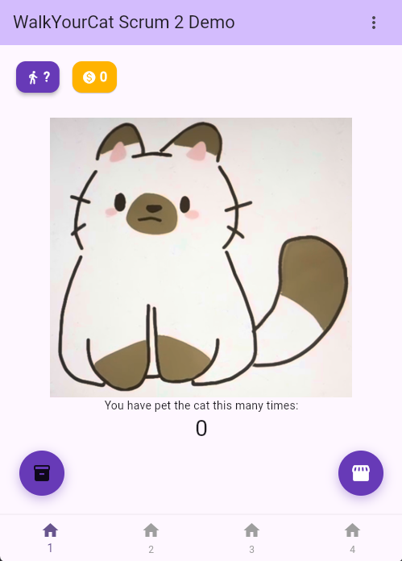

# WalkYourCat
## CIS 3296 Final Project
WalkYourCat is for people who want motivation to increase their daily physical activity and exercise. It is a fitness app grounded in game theory that allows users to convert their physical activity into a positive response loop by taking care of their virtual pet.



## UML Class Diagram


## Getting Started

To run and build WalkYourCat, install the flutter SDK. Flutter has [helpful instructions](https://docs.flutter.dev/install) for installation.

For help getting started with Flutter development in general, view the
[online documentation](https://docs.flutter.dev/), which offers tutorials,
samples, guidance on mobile development, and a full API reference.

## How to run
- If it's your first time running do the following 

```
flutter doctor -v
```

### fix errors first before continuing:
```
flutter clean
flutter get pub
```
- If the above steps have been done before just skip to the next command
- Download the latest binary from the Release section on the right on GitHub.  
- On the command line do:
```
flutter devices
```
- This command checks for devices available to run the app on.

for example
```
[1]: macOS (macos)
[2]: Windows (windows)
[3]: Chrome (chrome)
```

or a device if one is connected such as an Android or iPhone

- Once you select your chosen device/emulator to test the app, do:
```
flutter run <device-name>
```
- You will see the app open up on the browser or the phone

## How to contribute
Follow this project board to know the latest status of the project: [https://github.com/orgs/cis3296s26/projects/35]([https://github.com/orgs/cis3296s26/projects/35])  

## How to build locally during Development
- Clone and use this github repository: https://github.com/cis3296s26/WalkYourCat
- Specify what branch to use for a more stable release.  
- Use Andriod Studio for Android, XCode for IOS or any other IDE such as VSCode for the browser version
- To be able to run the code dart: ">=3.9.0-0 <4.0.0" and flutter: ">=3.35.0" is required to be installed prior
- Go to "How to run" to see how to run the app

## How to build an executable
### Android
```
    cd WalkYourCat
    flutter build apk --split-per-abi
```
From the Command line directly to your device:
- Connect your Android-powered device to your computer with a USB cable.
- Enter ```cd WalkYourCat```
- Run  ```flutter install```
### iOS (on macOS only)
Instructions in Progress...

- ```flutter build ipa```
### Web
- ```flutter build web```
### Desktop
- Builds a native Windows executable (.exe) and necessary DLL files

    - ```flutter build windows ```

- Builds a native macOS executable for Intel or Apple Silicon architecture

    - ```flutter build macos ```

- Builds a native Linux executable

    - ```flutter build linux```

## How to install
### Android
To install directly from the command line to your device, follow the instructions listed above in "How to Build an Executable" for Android.

To install from the apk:
- Download the ```.apk``` file from the latest [release](https://github.com/cis3296s26/WalkYourCat/releases) to your device.
- After downloading the file to your Android device, run the ```.apk``` and give it the permission to install WalkYourCat.


Note: If using an Android emulator (in Android Studio), the ```.apk``` file can be dragged and dropped from the file explorer of your operating system to anywhere on the emulator screen. Alternatively, one can run ```adb install path\to\apk``` to transfer the file to the emulator. Subsequently, the above step can be performed to install the app using the ```.apk```.

### iOS (on macOS only)
Instructions in Progress...