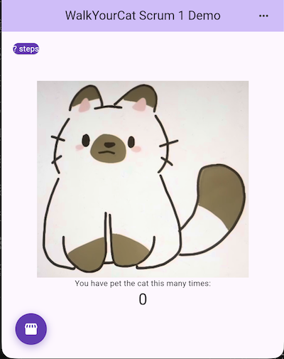

# Walk Your Cat

CIS 3296 Final Project

# Walk Your Cat
Walk Your Cat is for people who want motivation to increase their daily physical activity and exercise. Walk Your Cat is a fitness app grounded in game theory that allows users to convert their physical activity into a positive response loop by taking care of their virtual pet.



## Getting Started

This project is a starting point for a Flutter application.

A few resources to get you started if this is your first Flutter project:

- [Lab: Write your first Flutter app](https://docs.flutter.dev/get-started/codelab)
- [Cookbook: Useful Flutter samples](https://docs.flutter.dev/cookbook)

For help getting started with Flutter development, view the
[online documentation](https://docs.flutter.dev/), which offers tutorials,
samples, guidance on mobile development, and a full API reference.

## How to run
- Download the latest binary from the Release section on the right on GitHub.  
- On the command line run
```
flutter run
```
- Once it's started select the device/emulator to test the app for example
```
[1]: macOS (macos)
[2]: Chrome (chrome)

or a device if one is connected such as an adroid or iPhone
```
- You will see the app open up on the browser or the phone

## How to contribute
Follow this project board to know the latest status of the project: [https://github.com/orgs/cis3296s26/projects/35]([https://github.com/orgs/cis3296s26/projects/35])  

## How to build
- Use this github repository: https://github.com/cis3296s26/WalkYourCat
- Specify what branch to use for a more stable release or for cutting edge development.  
- Use Andriod Studio for Android, XCode for IOS or any other IDE such as VSCode for the browser version
- To be able to run the code  dart: ">=3.9.0-0 <4.0.0" and flutter: ">=3.24.0" is required to be installed prior
- run flutter doctor once to see if there are any error before continuing trying to run the app
- The App can be run via the terminal